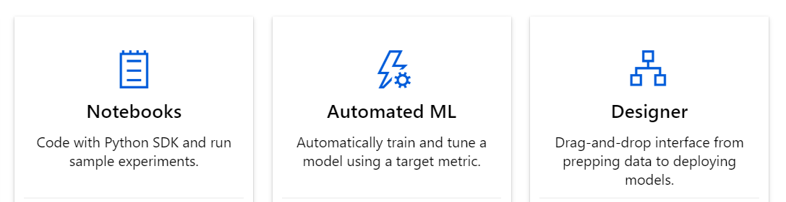

# Demos
We will walk through three separate experiences of using Azure machine learning services

* [Automated ML](https://docs.microsoft.com/en-us/azure/machine-learning/tutorial-first-experiment-automated-ml)
* [Drag-n-drop UI ("Designer")](https://docs.microsoft.com/en-us/azure/machine-learning/tutorial-designer-automobile-price-train-score)
* [Jupyter notebook](https://docs.microsoft.com/en-us/azure/machine-learning/tutorial-1st-experiment-sdk-setup)

## Use case
In each of these experiences, we will the [UCI automobile price dataset](https://archive.ics.uci.edu/ml/datasets/Automobile) to predict the price of an automobile based on its attributes. You can get a copy of the dataset [here](https://raw.githubusercontent.com/MicrosoftLearning/Principles-of-Machine-Learning-Python/master/Module7/Automobile%20price%20data%20_Raw_.csv)

## AutoML
With automated machine learning, you can automate away time intensive tasks. Automated machine learning rapidly iterates over many combinations of algorithms and hyperparameters to help you find the best model based on a success metric of your choosing. You can follow the [tutorial](https://docs.microsoft.com/en-us/azure/machine-learning/tutorial-first-experiment-automated-ml#create-a-workspace) at your own pace. 

## Designer
AzureML designer provides a drag and drop experience to build machine learning pipelines. You can use pre-build data loading, transformation and modeling modules. You can also publish models as RESTful API services from within the UX experience. You can follow the [tutorial](https://docs.microsoft.com/en-us/azure/machine-learning/tutorial-designer-automobile-price-train-score) at your own pace.

## Jupyter
You can also use AzureML through its python SDK. Example notebooks can be found [here](https://github.com/Azure/MachineLearningNotebooks). While you can use the SDK from any local/hosted compute of your choice, AzureML also provides managed notebook experience with pre-configured environments to accelerate your custom ML workflow. 
